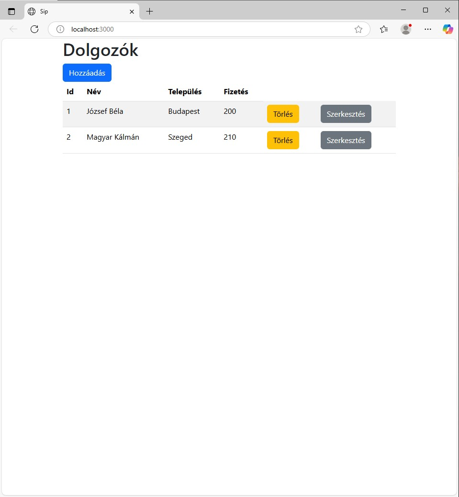
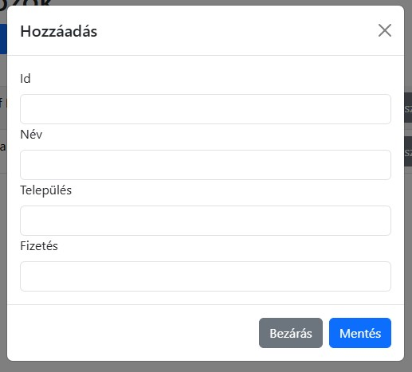
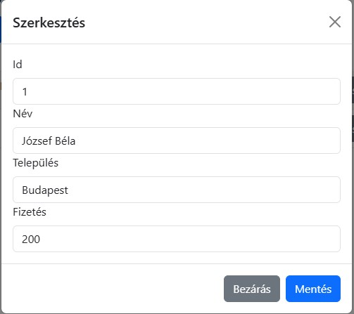

# Felhasználói dokumentáció

## Telepítés
Lépések: 
* Letöltés
* Függőségek telepítése
* Backend indítása
* Frontend indítása

### Letöltés
Töltse le a következő helyről: 
* https://github.com/suli2024/in_empke2.git
* [másik letöltési link](https://github.com/suli2024/in_empke2.git)

Például: 
```
git clone https://github.com/suli2024/in_empke2.git
```

### Függőségek telepítése és indítása
Backend:
```
cd api
npm install
npm start
```
Frontend:
```
cd web
npm install
npm start
```

## Dolgozók kezelése
* A főoldalon a dolgozók listáját láthatjuk:

* Új dolgozó felvétele:
 a táblázat felett a "Hozzáadás" gombra kattintva:

* A törlés gombra kattintva törölhető a dolgozó adatai:

* Szerkesztés gombra való kattintással lehet a dolgozó adatait módosítani:

*Az Id nevű mező nem szerkeszthető, sem a Hozzáadás, sem a Szerkesztés gombra kattintva, ugyanis az Id-t az adatbázis kezelő szerver adja hozzá a dolgozó adataihoz